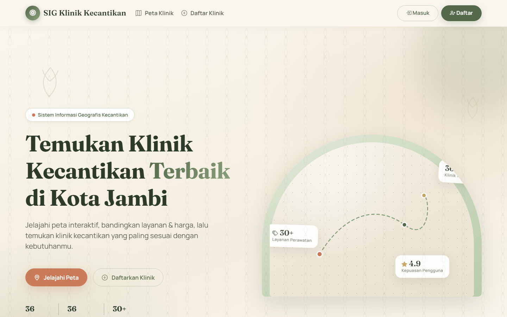
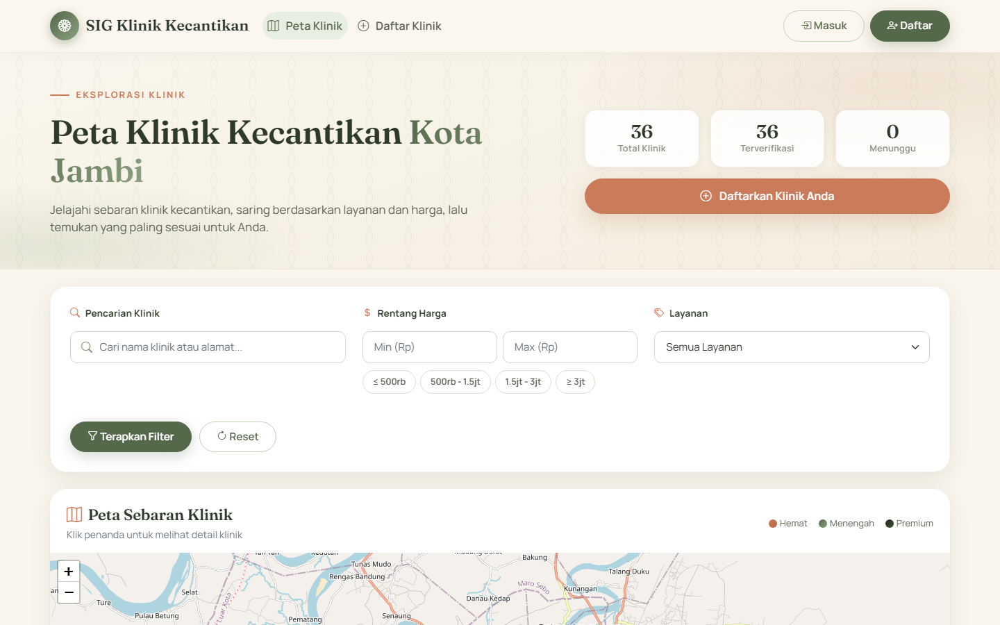
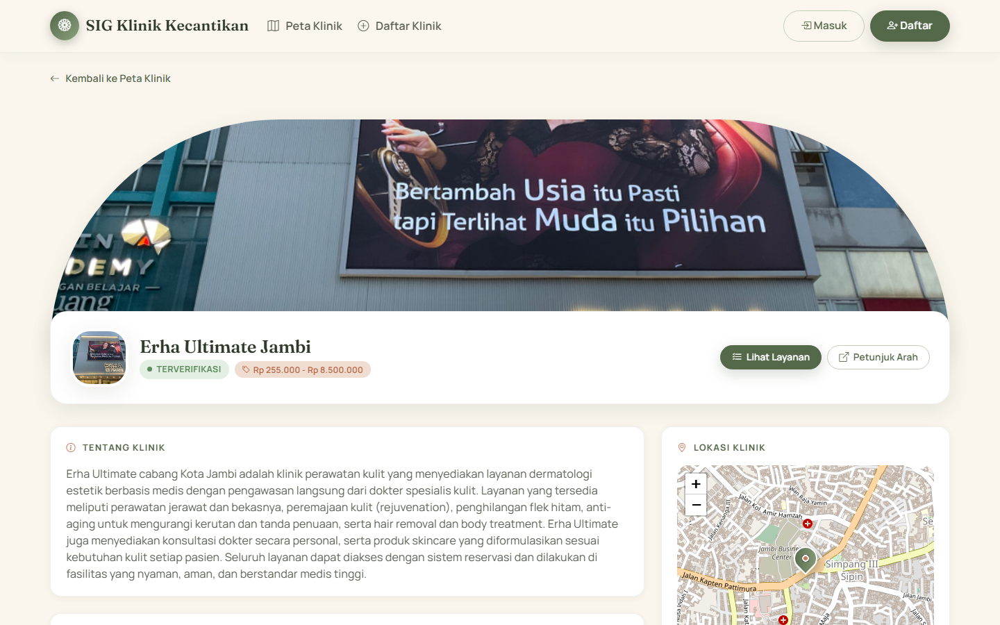
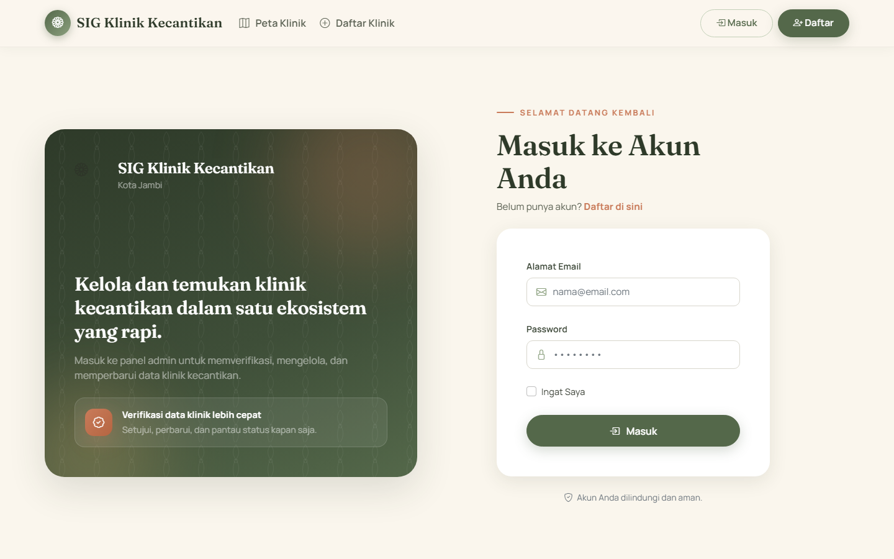
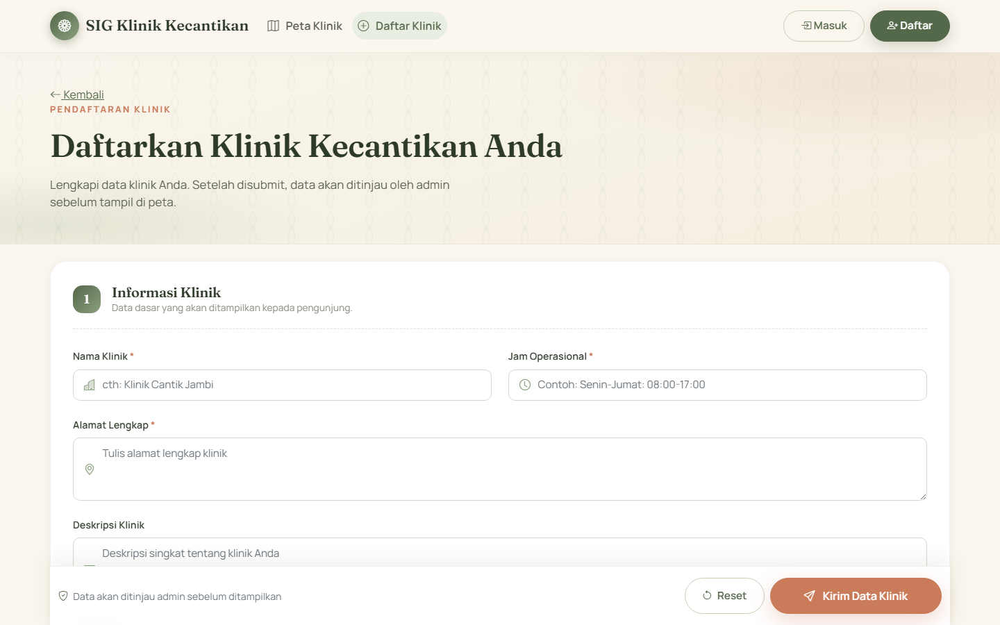
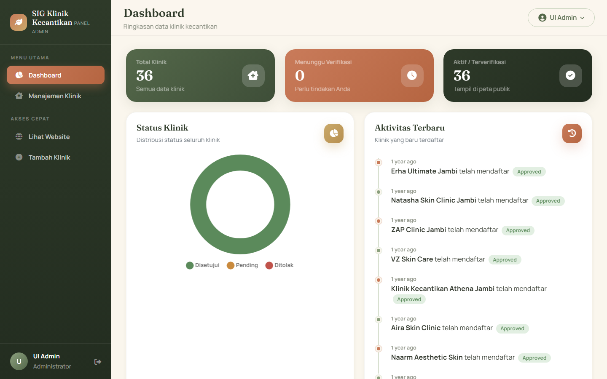
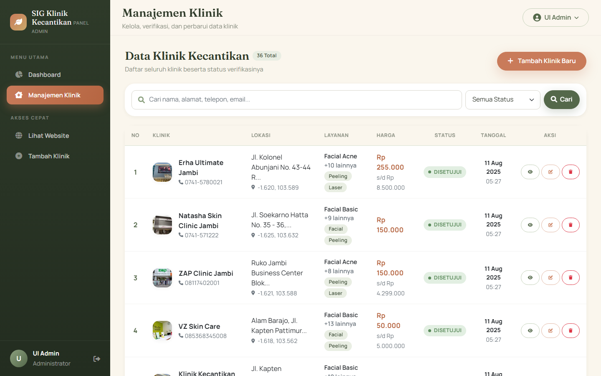
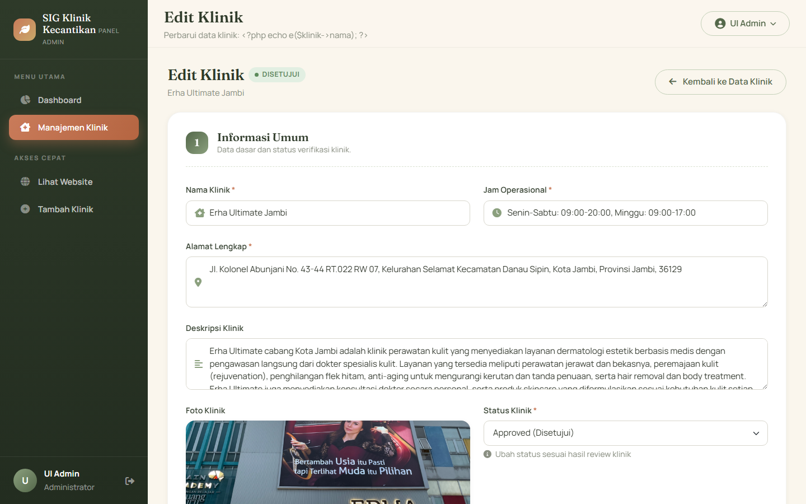

<div align="center">

# 🌿 SIG Klinik Kecantikan Kota Jambi

**Sistem Informasi Geografis (GIS) Klinik Kecantikan di Kota Jambi**

Sebuah platform web untuk memetakan, mencari, dan mengelola klinik kecantikan di Kota Jambi secara interaktif — dibangun dengan **Laravel 12** dan didesain dengan identitas visual **"Botanical Calm"**.


</div>

---

## 📌 Tentang Proyek

SIG Klinik Kecantikan adalah **Sistem Informasi Geografis** berbasis web yang dikembangkan sebagai proyek penelitian (pra-skripsi) untuk memetakan sebaran **klinik kecantikan di Kota Jambi**. Sistem ini dirancang untuk:

- 🗺️ Menyajikan **visualisasi data spasial** klinik kecantikan pada peta interaktif
- 🔍 Meningkatkan **aksesibilitas informasi** lokasi, layanan, dan harga bagi masyarakat
- ⚙️ Mendukung **pengambilan keputusan** melalui data klinik yang terverifikasi
- 🧑‍💼 Memberikan **sarana pengelolaan data** yang efisien bagi administrator

Sistem menampilkan **36 klinik kecantikan** yang tersebar di Kota Jambi, lengkap dengan detail layanan, harga perawatan, jam operasional, kontak, hingga tautan media sosial.

---

## 📸 Galeri

### 🏠 Sisi Publik

| Landing Page | Peta Interaktif |
|---|---|
|  |  |

| Detail Klinik | Login |
|---|---|
|  |  |

| Form Pendaftaran |
|---|
|  |

### 🧑‍💼 Sisi Admin

| Dashboard | Manajemen Klinik |
|---|---|
|  |  |

| Edit Klinik |
|---|
|  |

---

## ✨ Fitur Utama

### 🗺️ Sisi Publik (Pengunjung)

| Fitur | Deskripsi |
|---|---|
| **Landing Page** | Hero interaktif, marquee layanan, fitur unggulan, dan alur penggunaan |
| **Peta Interaktif** | Peta Leaflet dengan **marker botani custom** berkode warna kategori harga, popup lengkap, dan **legend kategori** (Hemat / Menengah / Premium) |
| **Filter Cerdas** | Pencarian nama/alamat, **chip rentang harga**, dan filter jenis layanan secara real-time |
| **Detail Klinik** | Profil lengkap — cover foto, badge verifikasi, **daftar layanan & harga per kategori**, kontak, media sosial, dan peta lokasi |
| **Form Pendaftaran Klinik** | 4 bagian terstruktur, **30+ layanan** dalam tile pilihan, picker lokasi peta draggable, dan bilah submit lengket (sticky) |
| **Autentikasi** | Login & register dengan **pencocokan email case-insensitive** |

### 🧑‍💼 Sisi Admin

| Fitur | Deskripsi |
|---|---|
| **Dashboard** | Kartu statistik gradien (total / pending / aktif), **chart donut status**, dan timeline aktivitas terbaru |
| **Manajemen Klinik** | Tabel data lengkap — pencarian, filter status, **pill status warna**, avatar, aksi verifikasi (Setujui / Tolak), edit, hapus |
| **Edit Klinik** | Form terstruktur + **peta interaktif draggable** untuk menggeser lokasi klinik |
| **Keamanan Peran** | Middleware **IsAdmin** — non-admin otomatis ditolak (403) |

### 🛡️ Keamanan & Anti-Penyalahgunaan

| Proteksi | Mekanisme |
|---|---|
| **Anti SQL Injection** | Query Eloquent *parameterized* + validasi ketat |
| **Rate Limiting** | Login **5/menit**, registrasi **3/jam**, submit klinik **2/jam** per IP |
| **Anti-Bot** | Honeypot field + *time-trap* (submit <3–5 detik ditolak) |
| **Validasi Input** | Regex nama, normalisasi email, **batas dimensi gambar** (4000×4000) |
| **Auto-Cleanup** | `klinik:cleanup` harian — hapus data ditolak/kedaluwarsa & file yatim |

---

## 🎨 Identitas Visual — "Botanical Calm"

Desain UI/UX dibangun dari nol sebagai sistem desain khusus:

- **Palet warna** — sage green `#54684A`, warm cream `#FAF6ED`, terracotta `#C97B5A`, emas `#C9A96A`
- **Tipografi** — *Fraunces* (display serif) + *Manrope* (sans geometris)
- **Elemen khas** — kartu lengkung (arch), blob organik, tekstur grain, aksen daun SVG
- **Motion** — reveal-on-scroll bertahap, marquee, micro-interaksi hover
- **Responsif penuh** — diuji pada 320px, 390px, dan 768px tanpa overflow horizontal

---

## 🧰 Teknologi

| Lapisan | Teknologi |
|---|---|
| **Backend** | Laravel 12, PHP 8.2, Blade templating |
| **Database** | MySQL 8 (`dbsigklinik`) |
| **Frontend** | Bootstrap 5, Font Awesome 6, Bootstrap Icons |
| **Peta** | Leaflet 1.9.4 (OpenStreetMap) |
| **Visualisasi** | Chart.js (donut chart dashboard) |
| **Interaksi** | jQuery, SweetAlert2 |
| **Fonts** | Google Fonts (Fraunces & Manrope) |

---

## 🚀 Instalasi & Menjalankan

```bash
# 1. Clone repositori
git clone <url-repo> sigklinikkecantikan
cd sigklinikkecantikan

# 2. Instal dependensi PHP
composer install

# 3. Salin konfigurasi lingkungan
cp .env.example .env
# lalu sesuaikan kredensial database di .env:
#   DB_CONNECTION=mysql
#   DB_HOST=127.0.0.1
#   DB_DATABASE=dbsigklinik
#   DB_USERNAME=root
#   DB_PASSWORD=

# 4. Generate application key
php artisan key:generate

# 5. Siapkan database (pilih salah satu)
#   Opsi A — import dump yang tersedia:
#     mysql -u root dbsigklinik < dbsigklinik.sql
#   Opsi B — migrasi + seeder:
#     php artisan migrate --seed        # AdminSeeder + KlinikSeeder (36 klinik)

# 6. Tautkan storage untuk foto klinik
php artisan storage:link

# 7. Jalankan server
php artisan serve
```

Buka **http://127.0.0.1:8000** di browser.

> ⚠️ **Pastikan direktori `storage` memiliki izin tulis** agar upload foto & session berjalan normal.

---

## 👤 Akun Default

| Peran | Email | Password |
|---|---|---|
| **Administrator** | `admin@gmail.com` | `admin123` |

> Login bersifat **case-insensitive** terhadap email (mis. `ADMIN@GMAIL.COM` juga diterima).

---

## ☁️ Deploy & Penyimpanan Foto (Produksi)

### VPS / Shared Hosting
```bash
# Tautkan storage agar foto dapat diakses via /storage/...
php artisan storage:link

# Atur di .env
APP_URL=https://domain-anda.com
PUBLIC_DISK=public
```

### Laravel Cloud / S3 (disarankan untuk penyimpanan persisten)
```bash
# Atur di .env (kredensial AWS otomatis di-inject Laravel Cloud)
PUBLIC_DISK=public_s3
```
- Upload file foto yang sudah ada ke bucket S3 di folder `klinik_photos/`
- URL foto otomatis mengarah ke S3 (tanpa symlink, persisten)

### 🔍 Foto tidak muncul? Jalankan diagnosa
```bash
php artisan storage:check
```
Perintah ini menampilkan: disk aktif, kelengkapan kredensial AWS (region/bucket/url/endpoint),
URL foto yang dihasilkan, keberadaan objek di bucket, dan status akses HTTP (200/403/404).

Perbaikan paling umum (hasil 403/404):
```bash
# 1. Upload foto lama dari komputer lokal ke bucket
aws s3 cp storage/app/public/klinik_photos/ s3://NAMA-BUCKET/klinik_photos/ --recursive --acl public-read

# 2. Pastikan bucket bisa dibaca publik (bukan 403):
#    - Matikan "Block all public access" di pengaturan bucket
#    - Tambahkan bucket policy s3:GetObject pada prefix klinik_photos/*
```

**Foto sudah di-upload tapi tetap 404?** Kemungkinan file masuk ke **root bucket**, padahal
aplikasi membacanya dari folder `klinik_photos/`. Perbaiki otomatis (salin root → `klinik_photos/`,
tanpa perlu tahu nama bucket) dengan membuka:
```
https://DOMAIN-ANDA/admin/storage-fix      # (login admin dulu)
```
atau jalankan `php artisan storage:fix-prefix` di terminal Laravel Cloud.

---

## 🛡️ Perlindungan Form Pendaftaran (Anti-Spam & Anti Data Fiktif)

Form publik `/klinik/create` dilindungi berlapis untuk meminimalkan spam dan data fiktif:

| Lapisan | Mekanisme |
|---|---|
| **Honeypot ganda** | 2 field tersembunyi (`company_website`, `fax_number`) — bot yang mengisi ditolak diam-diam (dibalas sukses palsu) |
| **Time-trap** | `form_started_at` wajib ada & minimal **8 detik** mengisi form |
| **Cloudflare Turnstile** (opsional) | Aktif bila `TURNSTILE_SITE_KEY`/`TURNSTILE_SECRET_KEY` diset di env |
| **Rate limit** | Maks **2 submit per 30 menit per IP** (admin login bebas) |
| **Validasi ketat** | Telepon format Indonesia, koordinat **wajib dalam wilayah Kota Jambi**, harga wajar, foto ≥ 200×200px, larang HTML, nama anti-gibberish |
| **Anti-duplikat** | Nomor telepon (atau email+nama) yang sama dengan data terdaftar → ditolak |

## 🧹 Perintah Tambahan

```bash
# Bersihkan data klinik sampah (ditolak / pending kedaluwarsa / file yatim)
php artisan klinik:cleanup

# Dengan pengaturan usia kustom
php artisan klinik:cleanup --days-rejected=7 --days-pending=30

# Lihat jadwal otomatis (berjalan tiap hari 02.00)
php artisan schedule:list
```

---

## 📁 Struktur Proyek

```
├── app/
│   ├── Console/Commands/       # KlinikCleanup (anti-bloat storage/database)
│   ├── Http/
│   │   ├── Controllers/        # Klinik, Admin, Auth, Api
│   │   └── Middleware/         # IsAdmin (proteksi peran admin)
│   ├── Models/                 # Klinik, User
│   └── Providers/              # Rate limiter (login/register/klinik)
├── bootstrap/app.php           # Registrasi alias middleware
├── config/                     # Konfigurasi aplikasi
├── database/
│   ├── migrations/
│   └── seeders/                # AdminSeeder, KlinikSampleSeeder
├── public/
│   └── css/beauty.css          # Design system "Botanical Calm"
├── resources/views/
│   ├── landing.blade.php       # Halaman utama
│   ├── public/                 # Map, detail, form pendaftaran
│   ├── admin/                  # Dashboard, manajemen & edit klinik
│   ├── auth/                   # Login & register
│   └── layouts/                # Layout publik & admin
└── routes/                     # web, admin, api, console
```

---

## 🛣️ Roadmap

- [x] Peta interaktif & filter klinik
- [x] Pendaftaran klinik publik dengan alur verifikasi admin
- [x] Panel admin (dashboard, manajemen, edit)
- [x] Rate limiting & anti-bot
- [ ] Pencarian rute / jarak terdekat dari lokasi pengguna
- [ ] Email verifikasi & notifikasi
- [ ] Statistik lanjutan (analisis sebaran & demografi)

---

## 📄 Lisensi

Proyek ini dirilis di bawah lisensi **MIT**. Dikembangkan sebagai bagian dari penelitian **Sistem Informasi Geografis** untuk klinik kecantikan di Kota Jambi.


